# Bilevel Layer-Positioning LoRA for Real Image Dehazing

Yan Zhang1 Long Ma³ Yuxin Feng4 Zhe Huang1 Fan Zhou1,2 Zhuo Su1,2,\*

1School of Computer Science and Engineering, Sun Yat-sen University 2National Engineering Research Center of Digital Life ’Dalian University of Technology 4Xidian University

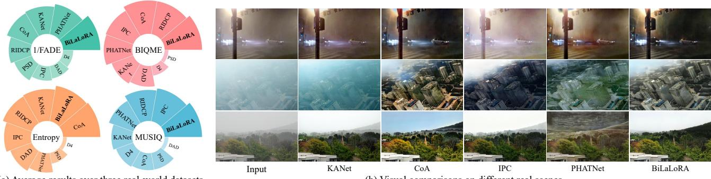  
(a)Average results over three real-world datasets  
(b) Visual comparisons on different real scenes

Figure 1. Performance comparison. Sub-figure (a) shows quantitative results on four non-reference metrics across three real-world datasets (RTTS [25], URHI [25],and Fattal [1O]),while sub-figure (b) presents visual comparisons on different challenging real scenes.

## Abstract

Learning-based real image dehazing methods have achieved notable progress， yet they still face adaptation challenges in diverse real haze scenes. These challenges mainly stem from the lack of effective unsupervised mechanisms for unlabeled data and the heavy cost of full model fine-tuning. To address these challenges,we propose the haze-to-clear text-directed loss that leverages CLIP's crossmodal capabilities to reformulate real image dehazing as a semantic alignment problem in latent space,thereby providing explicit unsupervised cross-modal guidance in the absence of reference images. Furthermore,we introduce the Bilevel Layer-positioning LoRA (BiLaLoRA） strategy, which learns both the LoRA parameters and automatically search the injection layers,enabling targeted adaptation of critical network layers.Extensive experiments demonstrate our superiority against state-of-the-art methods on multiple real-world dehazing benchmarks. The code is publicly available at https://github.com/YanZhang-zy/BiLaLoRA.

## 1. Introduction

Image dehazing,as one of the core research directions in low-level vision tasks,aims to remove atmospheric degradation caused by scattering and particulate absorption,enhancing visual quality and facilitating downstream tasks.

Traditional dehazing algorithms primarily rely on handcrafted priors,yet idealized assumptions limit their applicability [19]. In recent years,deep learning-based methods have demonstrated remarkable performance on synthetic datasets [14] [21] [22] [31]. These methods typically synthesize haze images based on the atmospheric scattering model,but the modeling process often oversimplifies the complex light field distribution and medium characteristics in the atmosphere, leading to significant domain gap between synthetic data and real-world scenarios [25] [29]. To mitigate this issue,researchers have begun exploring domain adaptation strategies to improve generalization capability [15] [36]. Despite notable progress,existing approaches still face two critical challenges:

· Lack of effective unsupervised mechanisms: Clean ground truth is hard to acquire in real scenes, so models often rely on synthetic data or weak priors,making it crucial to design effective unsupervised objectives for unpaired haze images to achieve robust dehazing across diverse real-world conditions.

· The heavy cost of full model fine-tuning: Even with effective unsupervised objectives,real image dehazing of-ten depends on updating all network parameters, leading to high computational and memory costs.This hinders fast adaptation in practical deployments,making it necessary to develop more effcient adaptation strategies.

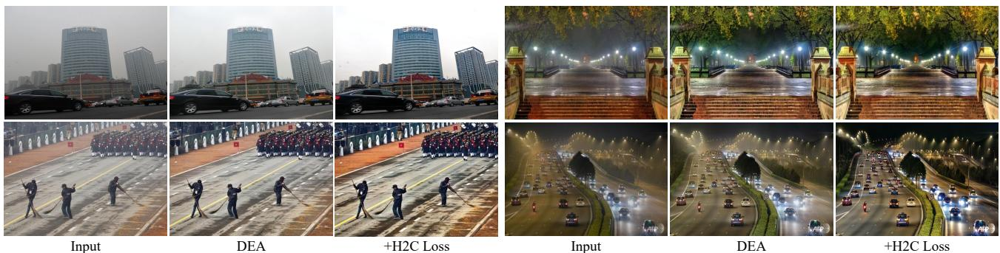  
Figure 2.Effectiveness of H2C loss in different real-scenes. The left two rows (daytime scenes)are from URHI and Fattal,and the right two rows (nightime scenes) are from NHRW [44].

## 1.1. Our Main Contributions

To address the domain adaptation challenges faced by dehazing models trained on synthetic data when applied to real-world scenes,we propose the Bilevel Layerpositioning LoRA (BiLaLoRA) framework. As shown in Fig.1,BiLaLoRA outperforms existing methods across three real-world datasets. Specifically,we first utilize the CLIP model [34] to design a Haze-to-Clear text-directed loss (H2C), reframing the dehazing task as a semantic mapping from haze to clear images.As shown in Fig.2, the H2C loss significantly enhances the performance of pre-trained models across various real-world scenes.However, Table 1 shows that applying the H2C loss with full fine-tuning incurs high computational costs with limited adaptability.

Through comprehensive analysis of the domain adaptation process,we observe that the performance bottleneck layers affected by the domain gap vary dynamically de-pending on the model architecture and scene characteristics. To address this dynamic behavior, BiLaLoRA employs low-rank adaptation for parameter-efficient fine-tuning and unifies the selection of adapter injection layers with weight optimization into a bilevel optimization problem, enabling more precise and efficient cross-domain adaptation. The main contributions are summarized as follows:

· To address the lack of effective unsupervised mechanisms，we propose the H2C loss by leveraging CLIP's cross-modal capability. It reformulates the dehazing process as a semantic alignment task in latent space, enabling flexible optimization without requiring paired real data.

· To mitigate the heavy cost of full model fine-tuning, we introduce BiLaLoRA,an effcient adaptation strategy. Through bi-level optimization of both the LoRA positions and weights,it automatically pinpoints and finetunes bottleneck layers without manual configuration.

· With minimal computational and storage overhead, Bi-LaLoRA achieves effcient transfer from synthetic to real domains. Its plug-and-play nature supports rapid switching multiple target domains, achieving an optimal balance among performance, efficiency,and flexibility.

## 2. Related Works

## 2.1. Real Image Dehazing

Real image dehazing aims to mitigate the negative effects of natural haze on visual quality as well as restore the colors and details. Although deep learning-based dehazing models demonstrate strong performance on synthetic datasets,they exhibit significant performance degradation in real-world scenes due to the synthetic-to-real domain gap.To bridge this gap,researchers have developed various strategies to reduce the distribution discrepancy between domains.Domain adaptation methods enhance crossdomain generalization by aligning feature distributions between source and target domains [37]. Physics-based priorconstrained methods integrate the atmospheric scattering model into the network design,guiding the model to learn more physically interpretable representations [3] [9]. Unsupervised approaches leverage Generative Adversarial Networks（GANs） to learn the dehazing mapping from unpaired data,thereby alleviating the dependency on largescale labeled datasets [42] [4O]. Other solutions involve using test-time adaptation for dynamically adjusting feature statistics [4] and leveraging pre-trained visual priors like VQGAN to boost content generation [41] [16]. Nevertheless, these approaches are typically constrained by complex training pipelines and substantial computational overhead, while lacking the flexibility necessary to accommodate diverse real-world degradation patterns.

## 2.2.Parameter-Efficient Fine-Tuning

Parameter-Efficient Fine-Tuning (PEFT) offers a solution to the aforementioned challenges. The core principle of PEFT is to freeze the pre-trained model while adapting only a small number of additional parameters, thereby enabling rapid adaptation to new tasks at a minimal computational cost. Low-Rank Adaptation (LoRA) [2O] represents a seminal PEFT technique that achieves performance comparable to full fine-tuning by injecting trainable low-rank matrices into selected weight layers. Originally developed for natural language processing, LoRA has been successfully extended to computer vision tasks [32]. For instance, Sun et al. [38] decoupled pixel-level reconstruction from semantic enhancement through LoRA modules,achieving high-quality controllable image super-resolution. Similarly, Zhong et al. [47] integrate LoRA with lightweight convolutions to incorporate local visual priors into the Segment Anything Model (SAM), substantially improving its crossdomain generalization in semantic segmentation. These successes demonstrate that LoRA provides an effcient and flexible paradigm for domain adaptation in vision tasks, particularly in resource constrained scenarios or situations requiring rapid adaptation to multiple target domains.

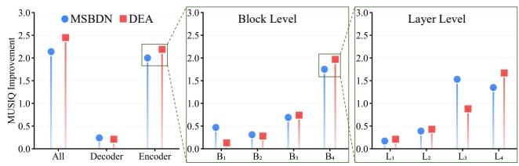  
Figure 3. Contribution of different network components to domain adaptation.

## 3. The H2C Unsupervised Loss

## 3.1. Latent Cross-Modality Consistency

In real image dehazing,a fundamental challenge arises from the absence of paired ground-truth clear images.This inherent limitation renders supervised paradigms that rely on reference images and pixel-level loss functions inapplicable. However, humans distinguish haze and clear images not relying on pixel-wise correspondences, but through high-level semantic understanding of the scene. This observation suggests that if such semantic comprehension can be formulated as computable guidance signals, it may be possible to circumvent the dependency on reference images.

Fortunately, the advent of vision-language models like CLIP has provided new pathways for addressing this challenge [27]. By constructing a unified latent embedding space, CLIP can effectively quantify the semantic content of images. Leveraging this capability, we propose a novel strategy based on the principle of cross-modality consistency, reconceptualizing the dehazing process as a semantic mapping from haze to clear and accordingly formulating an optimization objective that requires no paired supervision.

## 3.2.H2C: Haze-to-Clear Text-Directed Loss

To translate high-level semantic information into quantifiable guidance,we design a haze-to-clear text-directed loss (H2C) to align the semantic transformation of dehazing process with a target direction defined by text prompts. Specifically,for the input $I _ { \mathrm { i n } }$ and dehazing output $\boldsymbol { I _ { \mathrm { o u t } } }$ ，we utilize the pre-trained CLIP image encoder to extract their feature $V _ { \mathrm { i n } }$ and $V _ { \mathrm { o u t } } .$ ，which serve as their coordinates in the semantic space. Meanwhile,we use the CLIP text encoder to eXtract features from negative text prompt $T _ { \mathrm { n e g } }$ (a photo with haze)and positive text prompt $T _ { \mathrm { p o s } }$ (a clear photo),thereby defining the start and end points of the ideal transformation.

```csv
Algorithm1Bilevel Layer-positioning LoRA
Require:Initial LoRA weights ωo,architecture parameters αo,frozen
backbone parameters 0,step-size nw，na，total epochs T,switch
epoch $T _ { s } ,$ number of layers to select k.
Ensure:Optimized parameters $\omega ^ { \ast } , \alpha ^ { \ast } .$
1:% The Bilevel Layer-Positioning Stage
2:for $t = 0 : T _ { s } - \mathrm { 1 }$ do
3: % Update the architecture parameters
4: Calculate gradients g& by Eq.(7).
5: $\pmb { \alpha } _ { t + 1 } = \pmb { \alpha } _ { t } - \eta _ { \alpha } \pmb { g } _ { \alpha } ( \omega _ { t } , \pmb { \alpha } _ { t } , \pmb { \theta } )$
6: %Update the LoRA weights
7: $\omega _ { t + 1 } = \omega _ { t } - \eta _ { w } \nabla _ { \omega } f ( \omega _ { t } , \alpha _ { t + 1 } , \pmb \theta ) .$
8: end for
9:% Select top-k layers based on ranking scores
10: ${ \pmb { \alpha } } ^ { * } = \mathrm { T o p } \mathbf { \bar { K } } ( { \pmb { \alpha } } _ { T _ { s } } , k )$
11:% The LoRA Fine-Tuning Stage
12: for $t = T _ { s } : T$ do
13: %Update the LoRA weights under the optimized α*
14: $\omega _ { t + 1 } = \omega _ { t } - \eta _ { w } \nabla _ { \omega } f ( \omega _ { t } , \alpha ^ { * } , \pmb { \theta } ) .$
15:end for
16: $\omega ^ { * } = \omega _ { T } .$
17: return ${ \boldsymbol { \omega } } ^ { * } , { \boldsymbol { \alpha } } ^ { * } .$
```

Within the latent embedding space, the semantic transformation produced by the dehazing model is characterized by the displacement vector $\Delta V _ { \mathrm { i m g } } = V _ { \mathrm { o u t } } - V _ { \mathrm { i n } }$ ,which encodes the perceptual shift from haze to clear image.Concurrently，we define a target direction vector $\begin{array} { r l } { \Delta T _ { \mathrm { t e x t } } } & { { } = } \end{array}$ $T _ { \mathrm { p o s } } - T _ { \mathrm { n e g } }$ that represents the desired semantic trajectory in the text-guided feature space. The central objective of the H2C loss is to promote directional alignment between the image semantic transformation $\Delta V _ { \mathrm { i m g } }$ and the text-guided target direction $\Delta T _ { \mathrm { t e x t } }$ . To quantify this alignment, we employ cosine similarity as follows:

$$
L _ { \mathrm { H 2 C } } = 1 - \frac { \Delta V _ { \mathrm { i m g } } \cdot \Delta T _ { \mathrm { t e x t } } } { \| \Delta V _ { \mathrm { i m g } } \| _ { 2 } \cdot \left| \Delta T _ { \mathrm { t e x t } } \right| \| _ { 2 } } .\tag{1}
$$

## 3.3. Discussion

Notably, unlike domain adaptation methods that constrain feature space distributions,the H2C loss guides the model to generate clearer images by leveraging semantic information in the latent embedding space,without introducing additional complex structures.Moreover, the H2C loss demonstrates strong generalization across multiple realworld scenes with significant domain differences by ad-justing text prompts. As shown in Fig.2,DEA [5] effectively transfers from synthetic domain to real daytime scenes.Additionally, it adapts to nighttime scenes by using the prompt ‘a photo with nighttime haze'.By providing universal cross-domain guidance,the H2C loss effectively handles diverse haze patterns.

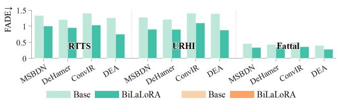

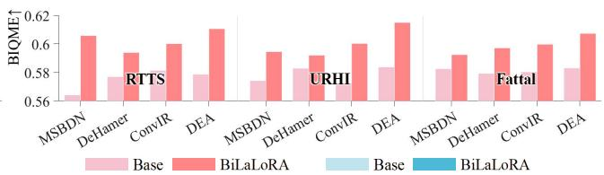

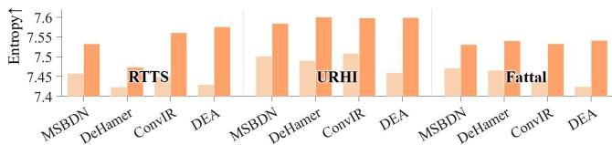

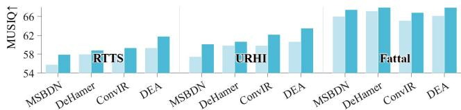  
Figure 4. Quantitative results of cross-model flexibility.We evaluate four baseline dehazing architectures on three real dehazing datasets with four non-reference metrics to ensure the generality of this property.

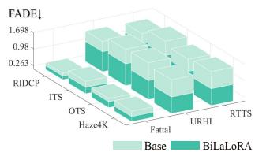

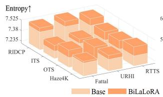

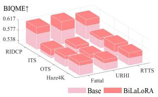

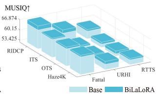  
Figure 5.Quantitative results of cross-domain stability. We leverage DEA pre-trained on four synthetic datasets to verify robustness across different source domains.

## 4. BiLaLoRA

## 4.1. Motivation

To pinpoint the network components most critical for domain adaptation,we fine-tuned MSBDN[8] and DEA on real-domain data using the H2C loss, then quantified each component's contribution by grafting adapted modules back into the original models and measuring the MUSIQ[23] improvements on the RTTS [25] dataset. As shown in Fig. 3, the encoder plays a crucial role,with its final block accounting for the majority of the performance gain. However, the specific layers within that block that drive the improvement differ substantially across architectures.This disparity indicates that the performance bottleneck caused by the domain gap is not static but shifts dynamically depending on the characteristics of the network architecture.

## 4.2. Model-Agnostic Layer-Positioning Modeling

Building upon these observations,we identify the central challenge in efficient domain adaptation as the precise positioning and optimization of performance bottleneck layers. As PEFT approach,LoRA provides an ideal solution to this problem. For a pre-trained weight matrix $W _ { 0 } \in \mathbb { R } ^ { d _ { \mathrm { o u t } } \times d _ { \mathrm { i n } } }$ ，

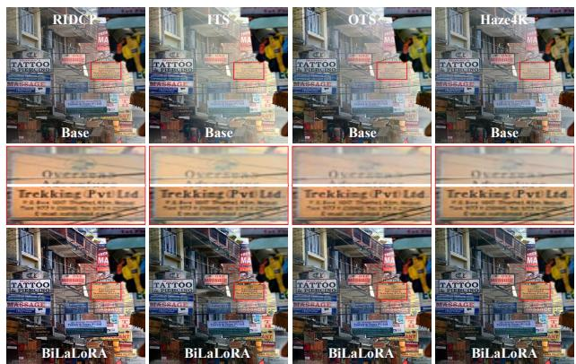  
Figure 6. Qualitative results of cross-domain stability. Bi-LaLoRA consistently enhances real-world performance across various source domains,with data from Fattal.

LoRA parameterizes the weight update △W via a low-rank decomposition using trainable matrices $\boldsymbol { A } \ \in \ \mathbb { R } ^ { r \times d _ { \mathrm { i n } } }$ and $B \in \mathbb { R } ^ { d _ { \mathrm { o u t } } \times r }$ ,where $r \ll \operatorname* { m i n } ( d _ { \mathrm { o u t } } , d _ { \mathrm { i n } } )$ denotes the rank.

However, the effectiveness of LoRA is critically contingent upon the strategic selection of injection layers. Conventional approaches predominantly rely on heuristic or empirically driven choices,which lack generalizability across diverse architectural paradigms. To overcome this limitation, we reformulate the layer selection problem as a differentiable architecture search task. Specifically, we regulate each LoRA module with a learnable gating parameter α,which is constrained to the range(O,1） using a sigmoid function and modulates the contribution of the low-rank increment in conjunction with the scaling factor y:

$$
W ^ { \prime } = W _ { 0 } + \alpha \cdot \gamma \cdot \Delta W ,\tag{2}
$$

in which α serves as a continuous relaxation of the discrete layer selection decision.

## 4.3.BiLaLoRA: Bilevel Layer-Positioning LoRA

Given the hierarchical dependency between architectural parameters and LoRA weight matrices， single-level optimization frameworks fail to capture this inherent rela-

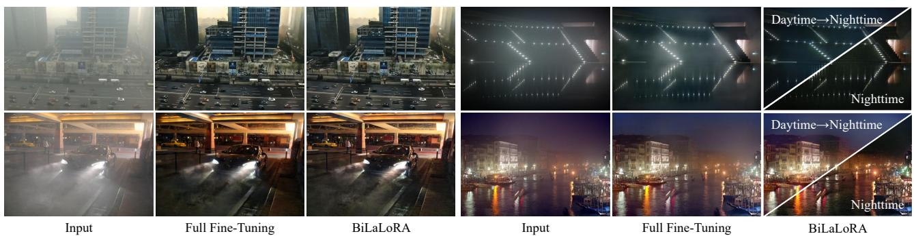  
Figure 7. Qualitative results of fullfine-tuning vs.BiLaLoRA. The left two rows are from RTTS and the right two rows are from NHRW.

tionship． To address this limitation,we propose Bilevel Layer-Positioning LoRA (BiLaLoRA)，which formulates the learning objective as a bilevel optimization problem:

$$
\begin{array} { r l } & { \underset { \boldsymbol { \alpha } } { \operatorname* { m i n } } \ \varphi ( \omega ^ { * } ( \pmb { \alpha } ) , \pmb { \alpha } ) , } \\ & { \mathrm { s . t . } \omega ^ { * } ( \pmb { \alpha } ) \in \arg \underset { \omega } { \operatorname* { m i n } } \ \psi ( \omega , \pmb { \alpha } ) , } \end{array}\tag{3}
$$

where $\varphi$ and $\psi$ denote BiLaLoRA's upper and lower objectives for optimizing the architectural parameters governing the layer selection α and low-rank weight increments $\Delta W$ ， respectively. The principal computational challenge lies in evaluating the hypergradient $\nabla _ { \alpha \varphi }$ for the upper-level ob-jective.Due to the implicit dependence of $\omega ^ { \ast }$ on α,this gradient admits the following chain rule decomposition:

$$
\begin{array} { r } { \pmb { g } _ { \alpha } = \nabla _ { \alpha } \varphi ( \pmb { \omega } ^ { * } , \pmb { \alpha } ) + \nabla _ { \alpha } \pmb { \omega } ^ { * } ( \pmb { \alpha } ) ^ { T } \nabla _ { \omega } \varphi ( \pmb { \omega } ^ { * } , \pmb { \alpha } ) . } \end{array}\tag{4}
$$

Direct computation of the Jacobian $\nabla _ { \alpha } \omega ^ { \ast } ( \alpha )$ is prohibitively expensive. To circumvent this,we denote the lower-level objective as $f .$ Using the first-order optimality condition $\nabla _ { \omega } f ( \omega ^ { \ast } , \alpha ) = 0$ and applying the implicit function theorem [24], we obtain:

$$
\nabla _ { \alpha } \omega ^ { * } ( \alpha ) = - \left[ \nabla _ { \omega \omega } ^ { 2 } f ( \omega ^ { * } , \alpha ) \right] ^ { - 1 } \nabla _ { \omega \alpha } ^ { 2 } f ( \omega ^ { * } , \alpha ) .\tag{5}
$$

However, computing and inverting the Hessian matrix $\nabla _ { \omega \omega } ^ { 2 } f$ remains computationally intractable for large-scale models. We therefore adopt a rank-one outer-product approximation [28], which yields:

$$
\nabla _ { \omega \omega } ^ { 2 } f \approx \nabla _ { \omega } f \nabla _ { \omega } f ^ { T } , \quad \nabla _ { \omega \alpha } ^ { 2 } f \approx \nabla _ { \omega } f \nabla _ { \alpha } f ^ { T } .\tag{6}
$$

This approximation is equivalent to a one-shot rank-one quasi-Newton update. Substituting Eqs. (5) and (6) into Eq. (4),we derive a computationally efficient hypergradient estimator that relies solely on first-order derivatives:

$$
\mathbf { \pmb { g } } _ { \alpha } \approx \nabla _ { \alpha } \varphi - \frac { \nabla _ { \omega } \varphi ^ { T } \nabla _ { \omega } f } { \| \nabla _ { \omega } f \| ^ { 2 } } \nabla _ { \alpha } f .\tag{7}
$$

Specifically, the implementation of BiLaLoRA is divided into two stages. In the Bilevel layer positioning stage, we solve the bilevel problem (3) to rank the importance of all candidate LoRA injection sites based on architectural parameters $_ { \alpha . }$ Subsequently, in the LoRA fine-tuning phase, we adapt the top-k highest-ranked modules to achieve optimal performance on the target domain. The complete procedure is detailed in Algorithm 1.

Table 1. Quantitative results of full fine-tuning vs.BiLaLoRA.
<table><tr><td rowspan=1 colspan=2>Metric</td><td rowspan=1 colspan=1>Fine-Tuning</td><td rowspan=1 colspan=1>BiLaLoRA</td><td rowspan=1 colspan=1>Rate</td></tr><tr><td rowspan=4 colspan=1>Prrirotetr</td><td rowspan=1 colspan=1>FADE↓</td><td rowspan=1 colspan=1>0.610</td><td rowspan=1 colspan=1>0.638</td><td rowspan=1 colspan=1>↓4.59%</td></tr><tr><td rowspan=1 colspan=1>BIQME↑</td><td rowspan=1 colspan=1>0.617</td><td rowspan=1 colspan=1>0.611</td><td rowspan=1 colspan=1>↓0.97%</td></tr><tr><td rowspan=1 colspan=1>Entropy↑</td><td rowspan=1 colspan=1>7.569</td><td rowspan=1 colspan=1>7.572</td><td rowspan=1 colspan=1>↑0.04%</td></tr><tr><td rowspan=1 colspan=1>MUSIQ↑</td><td rowspan=1 colspan=1>64.43</td><td rowspan=1 colspan=1>64.40</td><td rowspan=1 colspan=1>↓0.05%</td></tr><tr><td rowspan=4 colspan=1>Feeeef</td><td rowspan=1 colspan=1>Train Time (H)</td><td rowspan=1 colspan=1>4.215</td><td rowspan=1 colspan=1>0.940</td><td rowspan=1 colspan=1>↓77.70%</td></tr><tr><td rowspan=1 colspan=1>Params. (M)</td><td rowspan=1 colspan=1>3.653</td><td rowspan=1 colspan=1>3.764</td><td rowspan=1 colspan=1>↑3.03%</td></tr><tr><td rowspan=1 colspan=1>FLOPst (G)</td><td rowspan=1 colspan=1>34.04</td><td rowspan=1 colspan=1>34.08</td><td rowspan=1 colspan=1>↑1.18%</td></tr><tr><td rowspan=1 colspan=1>Runtimet(MS)</td><td rowspan=1 colspan=1>3.702</td><td rowspan=1 colspan=1>3.735</td><td rowspan=1 colspan=1>↑0.89%</td></tr></table>

+ FLOPs and Runtime are calculated on 256×256 input.

## 4.4. Exploring Algorithmic Property

## 4.4.1. Cross-Model Flexibility

To validate the model-agnostic property of BiLaLoRA, we applied it to four representative dehazing models (MSBDN, DeHamer [18], ConvIR [7],and DEA),all of which were uniformly pre-trained on the THaze [13] dataset. Fig. 4 presents a comparative analysis of performance metrics before and after applying BiLaLoRA. Experiments demonstrate that BiLaLoRA effectively adapts to different network architectures while automatically positioning and optimizing performance bottleneck layers,substantially enhancing the performance of existing pre-trained models.

## 4.4.2. Cross-Domain Stability

Subsequently,we employed DEA as the baseline model and conducted comprehensive experiments across four synthetic datasets (RIDCP [41]，ITS [25]，OTS [25]，and Haze4K [29]). As demonstrated in Fig. 5, BiLaLoRA consistently improved the performance of DEA models pretrained on various datasets. Visual comparisons in Fig. 6 further substantiate that BiLaLoRA effectively recovers image content obscured by haze, leading to substantially enhanced dehazing performance in real-world applications.

Table 2.Quantitative evaluations.All metrics are computed on RTTS, URHI and Fattal.
<table><tr><td colspan="3">Method</td><td colspan="4">RTTS [25]</td><td colspan="4">URHI [25]</td><td colspan="4">Fattal [10]</td><td colspan="4">Average</td></tr><tr><td colspan="2">Name</td><td>Venue</td><td>FADE BIQME Entropy MUSIQ</td><td></td><td></td><td></td><td>FADE BIQME Entropy MUSIQ</td><td></td><td></td><td></td><td></td><td></td><td>FADE BIQME Entropy MUSIQ</td><td></td><td></td><td>FADE BIQME Entropy MUSIQ</td><td></td></tr><tr><td></td><td>MSBDN [8]</td><td>CVPR 20</td><td>1.483</td><td>0.549</td><td>7.273</td><td>52.93</td><td>1.517 0.542</td><td></td><td>7.264</td><td>54.68</td><td>0.613 0.555</td><td>7.408</td><td>63.71</td><td>1.204</td><td>0.568</td><td>7.315</td><td>57.11</td></tr><tr><td>opapitte</td><td>DeHamer [18]</td><td>CVPR 22</td><td>1.806</td><td>0.542</td><td>7.215</td><td>52.90</td><td>1.853 0.537</td><td>7.217</td><td>54.67</td><td>0.756</td><td>0.552</td><td>7.411</td><td>64.31</td><td>1.472</td><td>0.544</td><td>7.281</td><td>57.29</td></tr><tr><td></td><td>c2PNet 46]</td><td>CVPR 23</td><td>2.050</td><td>0.531</td><td>7.168</td><td>54.18</td><td>2.054 0.524</td><td>7.157</td><td>56.48</td><td>0.720</td><td>0.551</td><td>7.399</td><td>65.00</td><td>1.608</td><td>0.535</td><td>7.241</td><td>58.55</td></tr><tr><td></td><td>DEA [5]</td><td>TIP 24</td><td>1.781</td><td>0.541</td><td>7.196</td><td>53.13</td><td>1.891 0.534</td><td>7.198</td><td>54.89</td><td>0.696</td><td>0.557</td><td>7.423</td><td>64.23</td><td>1.456</td><td>0.544</td><td>7.272</td><td>57.42</td></tr><tr><td></td><td>PromptIR [33]</td><td>NeurIPS23</td><td>1.765</td><td>0.546</td><td>7.189</td><td>53.80</td><td>1.747 0.544</td><td>7.390</td><td>55.97</td><td>0.668</td><td>0.558</td><td>7.498</td><td>64.96</td><td>1.393</td><td>0.549</td><td>7.359</td><td>58.24</td></tr><tr><td>11O-1I-Ii</td><td>DiffUIR [45]</td><td>CVPR 24</td><td>2.132</td><td>0.531</td><td>7.172</td><td>54.81</td><td>2.014 0.527</td><td>7.181</td><td>56.39</td><td>0.871</td><td>0.537</td><td>7.373</td><td>64.95</td><td>1.672</td><td>0.532</td><td>7.242</td><td>58.72</td></tr><tr><td></td><td>MoCE-IR [43]</td><td>CVPR 25</td><td>1.922</td><td>0.539</td><td>7.191</td><td>54.21</td><td>1.664 0.541</td><td>7.217</td><td>57.25</td><td>0.678</td><td>0.557</td><td>7.409</td><td>65.01</td><td>1.421</td><td>0.546</td><td>7.272</td><td>58.82</td></tr><tr><td></td><td>FoundIR [26]</td><td>ICCV 25</td><td>1.760</td><td>0.553</td><td>7.275</td><td>54.96</td><td>1.762 0.550</td><td>7.301</td><td>57.12</td><td>0.759</td><td>0.560</td><td>7.376</td><td>65.83</td><td>1.427</td><td>0.554</td><td>7.317</td><td>59.30</td></tr><tr><td rowspan="8"></td><td>DAD [36]</td><td>CVPR 20</td><td>1.131</td><td>0.561</td><td>7.413</td><td>49.34</td><td>1.099 0.566</td><td></td><td>7.439 50.83</td><td>0.487</td><td>0.589</td><td>7.487</td><td>59.38</td><td>0.905</td><td>0.572</td><td>7.446</td><td>53.18</td></tr><tr><td>PSD [3]</td><td>CVPR 21</td><td>1.143</td><td>0.524</td><td>7.276</td><td>52.81</td><td>0.937</td><td>0.517</td><td>7.252</td><td>55.99</td><td>0.438 0.554</td><td>7.463</td><td>63.80</td><td>0.839</td><td>0.532</td><td>7.330</td><td>57.53</td></tr><tr><td>D4 [42]</td><td>CVPR 22</td><td>1.404</td><td>0.556</td><td>7.179</td><td>53.57</td><td>1.116 0.549</td><td>7.236</td><td>56.27</td><td>0.457</td><td>0.537</td><td>7.372</td><td>64.14</td><td>0.992</td><td>0.547</td><td>7.262</td><td>57.99</td></tr><tr><td>RIDCP [41]</td><td>CVPR 23</td><td>0.955</td><td>0.600</td><td>7.541</td><td>59.14</td><td>0.922</td><td>0.603</td><td>7.559 61.73</td><td>0.396</td><td>0.604</td><td>7.468</td><td>66.10</td><td>0.758</td><td>0.602</td><td>7.523</td><td>62.32</td></tr><tr><td>KANet [12]</td><td>TPAMI 24</td><td>0.870</td><td>0.583</td><td>7.517</td><td>54.54</td><td>0.867</td><td>0.589</td><td>7.555 56.75</td><td>0.338</td><td>0.560</td><td>7.527</td><td>65.35</td><td>0.692</td><td>0.577</td><td>7.533</td><td>58.88</td></tr><tr><td>CoA [30]</td><td>CVPR 25</td><td>0.859</td><td>0.593</td><td>7.579</td><td>53.43</td><td>0.927</td><td>0.596</td><td>7.592 55.93</td><td>0.314</td><td>0.618</td><td>7.585</td><td>63.38</td><td>0.700</td><td>0.602</td><td>7.585</td><td>57.58</td></tr><tr><td>IPC [16]</td><td>CVPR 25</td><td>1.105</td><td>0.592</td><td>7.469</td><td>59.61</td><td>1.103</td><td>0.592</td><td>7.512 62.22</td><td>0.368</td><td>0.593</td><td>7.471</td><td>67.58</td><td>0.858</td><td>0.592</td><td>7.484</td><td>63.14</td></tr><tr><td>PHATNet [39]</td><td>ICCV 25</td><td>0.845</td><td>0.585</td><td>7.349</td><td>56.43</td><td>0.892 0.582</td><td>7.390</td><td>58.34</td><td>0.331</td><td>0.604</td><td>7.498</td><td>66.87</td><td>0.689</td><td>0.590</td><td>7.412</td><td>60.55</td></tr><tr><td colspan="2">BiLaLoRA</td><td>Ours</td><td>0.752</td><td>0.611</td><td>7.576</td><td>61.77</td><td>0.881</td><td>0.615</td><td>7.599 63.52</td><td>0.281</td><td>0.607</td><td></td><td>7.541 67.92</td><td>0.638</td><td>0.611</td><td>7.572</td><td>64.40</td></tr></table>

(a)Input; (b)PromptIR;(c)DiffUIR;(d) MOCE-IR; (e) FoundIR;(f) DAD;(g) PSD;(h) D4;(i) RIDCP; (j)KANet; (k)CoA; (l) IPC;(m) PHATNet; (n) BiLaLoRA  
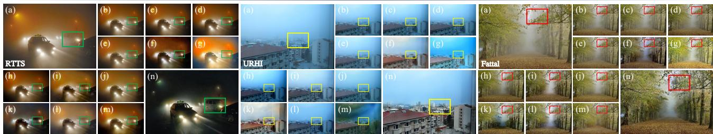  
Figure 8. Visual comparisons on different datasets.Boxes indicate specific areas that highlight differences.

## 4.4.3.Full Fine-Tuning vs.BiLaLoRA

As shown in Table 1,while full fine-tuning achieves satisfactory performance,BiLaLoRA attains comparable results with dramatically reduced training time by optimizing only adapter parameters.Notably,BiLaLoRA maintains similar FLOPs and parameters with negligible inference overhead. In addition,real-world dehazing tasks often encounter complex domain shifts.As illustrated in Fig.7,the fully finetuned model and adapter trained on daytime scenes cannot generalize to nighttime conditions. BiLaLoRA addresses this by training a separate nighttime adapter that achieves superior performance without costly full fine-tuning,thus facilitating eficient adaptation across diverse scenarios.

## 5. Experimental Results

## 5.1.Implementation Details

Training settings. The BiLaLoRA was implemented using the PyTorch framework on a single NVIDIA 4090 GPU.For all experiments,we adopted DEA as the baseline and employed the Adam optimizer to update parameters,with $\beta _ { 1 }$ $\beta _ { 2 }$ ,and ε set to 0.9,0.999,and $1 \times 1 0 ^ { - 8 }$ ,respectively. During the pre-training stage,the baseline model was trained on the THaze dataset using $\ell _ { 1 }$ loss,with the learning rate initialized at $1 \times 1 0 ^ { - 4 }$ and gradually decayed to $1 \times 1 0 ^ { - 6 }$ using cosine annealing scheduling. For domain adaptation in the BiLaLoRA stage, two domain-specific adapters were developed for daytime and nighttime dehazing. These were trained respectively using 5OO real daytime haze images [6] and 10O nighttime images from NHRW [44], with both datasets being split equally into training and validation sets.We conducted bilevel layer-positioning and LoRA fine-tuning on the top-3 layers using the H2C loss,maintaining a learning rate of $1 \times 1 0 ^ { - 6 }$ . For the LoRA modules, we set the scaling factor to $\gamma = 2 .$ ，with the rank configured to r = 8. During all training stages,we augmented the training data by cropping random 256 × 256 patches from the images,which were then subjected to random 9Oo,180°, and $2 7 0 ^ { \circ }$ rotations and horizontal flipping.

Benchmarks and metrics. To thoroughly evaluate the model,we conducted experiments on three real datasets: RTTS,URHI, and Fattal, which comprise 4,322,150, and 31 images,respectively.Additionally，we assessed the model's generalization capability on the HazyDet [11], Dense-Haze [2],and O-Haze [1] datasets.For quantitative assessment,we employed four no-reference metrics:

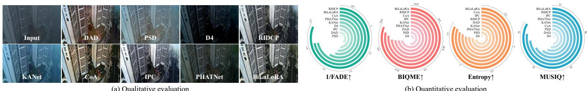  
Figure 9. Generalization evaluation on HazyDet dataset. All models were evaluated on the testing dataset without retraining.

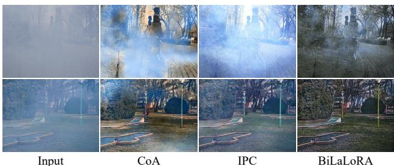  
Figure 1O.Generalization evaluation on other real datasets. Dense-Haze (Top) and O-Haze (Bottom).All models were evalu-ated on the testing dataset without retraining.

the fog density assessment method (FADE) [6], the blind image quality metric for enhanced images (BIQME) [17], the image entropy assessment index (Entropy) [35],and the multi-scale image quality transformer (MUSIQ) [23].

## 5.2. Performance Evaluation

To comprehensively evaluate the performance of Bi-LaLoRA, we conducted extensive quantitative and qualitative analyses,comparing it against various state-of-the-art specialized dehazing methods and general all-in-one image restoration models.Additional experimental details and analytical results are provided in the supplementary material. Quantitative Evaluation. The quantitative results in Table 2 demonstrate the strong performance of BiLaLoRA. Compared with state-of-the-art methods,our model ranks first or second across key evaluation metrics,fully demon-strating its outstanding performance in real image dehazing. Qualitative Evaluation. Fig. 8 presents qualitative comparisons on the RTTS,Fattal, and URHI datasets. Allin-one models demonstrate limited generalization to realworld scenes. Specialized dehazing methods exhibit various limitations: DAD,D4,and KANet fail to adequately handle colored haze; PSD suffers from overexposure and color shift; and PHATNet produces visual artifacts.While RIDCP, CoA,and IPC yield comparatively better results, they still lack in detail fidelity and naturalness.In contrast, BiLaLoRA effectively removes haze while better preserving fine details and maintaining natural appearance.

## 5.3. Generalization Evaluation

To further validate the robustness of BiLaLoRA,we conducted additional evaluations under more challenging conditions.As illustrated in Fig.9,when evaluated on the realworld UAV-perspective haze dataset HazyDet, our method successfully recovers scene details obscured by haze while effectively preventing color distortion,with qualitative results confirming its efficacy. Moreover, as shown in Fig.10, the performance of previously competitive methods such as CoA and IPC deteriorates substantially on dense haze datasets including Dense-Haze and O-Haze,where they almost fail to generate meaningful dehazing outputs. By comparison,BiLaLoRA maintains consistent performance even under these extreme conditions, demonstrating excellent generalization capability across diverse scenarios.

Table 3. Quantitative evaluation of ablation study.
<table><tr><td rowspan="2">Model</td><td>H2CLoss</td><td>Layer-Positioning</td><td></td><td colspan="4">Averaged Performance</td></tr><tr><td>PositiveNegative</td><td>Naive</td><td>Bilevel</td><td>FADE</td><td>BIQME</td><td>Entropy</td><td>MUSIQ</td></tr><tr><td>Qa</td><td>×</td><td>×</td><td>× ×</td><td>1.018</td><td>0.582</td><td>7.438</td><td>62.05</td></tr><tr><td> $\mathrm { Q } _ { \mathrm { b } }$ </td><td>√ ×</td><td>×</td><td>×</td><td>0.862</td><td>0.589</td><td>7.544</td><td>62.23</td></tr><tr><td> $\mathrm { Q } _ { \mathrm { c } }$  Q</td><td>√ ×</td><td>√</td><td>×</td><td>0.705</td><td>0.592</td><td>7.559</td><td>62.35</td></tr><tr><td>Qe</td><td>√</td><td>× × ×</td><td>√</td><td>0.680</td><td>0.601</td><td>7.563</td><td>62.57</td></tr><tr><td>Qf</td><td>×</td><td>√ √</td><td>×</td><td>0.774</td><td>0.561</td><td>7.533</td><td>60.47</td></tr><tr><td></td><td>×</td><td>√ √</td><td>×</td><td>0.745</td><td>0.579</td><td>7.537</td><td>61.04</td></tr><tr><td> $\underline { { \mathrm { ~ Q ~ } _ { \mathrm { g } } } }$ </td><td>×</td><td>×</td><td>√</td><td>0.712</td><td>0.584</td><td>7.541</td><td>61.23</td></tr><tr><td> $\mathrm { Q } _ { \mathrm { h } }$ </td><td>√</td><td>√ ×</td><td>×</td><td>0.774</td><td>0.600</td><td>7.559</td><td>63.31</td></tr><tr><td>Qi</td><td>√</td><td>√ √</td><td>×</td><td>0.662</td><td>0.607</td><td>7.566</td><td>64.07</td></tr><tr><td>Ours</td><td>√ √</td><td>×</td><td>√</td><td>0.638</td><td>0.611</td><td>7.572</td><td>64.40</td></tr></table>

## 6. Algorithmic Analyses

## 6.1.Effects of Text-Directed Loss

To validate the efficacy of the directional guidance mechanism within the H2C loss,we conduct an ablation study comparing the full loss against two degraded variants,as presented in Table 3. After removing the negative guidance,the model aligns the output image features solely with the semantic representation of the positive text. This simplified configuration causes the H2C loss to drive the outputs toward a singular positive semantic target, thereby neglecting content consistency with the input. As illustrated in Fig.11,while this variant achieves partial haze removal, it introduces substantial color distortion artifacts. Conversely, in the absence of positive text guidance, the optimization objective becomes dominated by excessive suppression of haze related features,ultimately culminating in over-dehazing phenomena.These findings demonstrate that the H2C loss,through the synergistic interplay of positive and negative textual constraints,establishes a well-defined semantic optimization trajectory for the dehazing process, ensuring effective haze removal while maximally preserving the structural integrity of the original scene.

  
Figure 11. Qualitative results of ablation study. Visual comparison of different combinations in Table 3, with data from URHI.

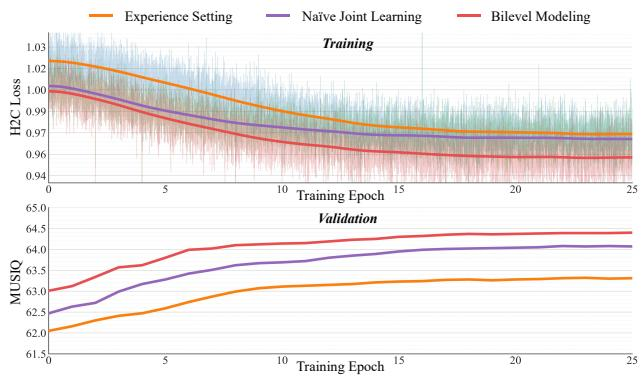  
Figure 12. Convergence behaviors. H2C loss convergence (Top) and MUSIQ improvement (Bottom) over training epochs.

## 6.2. Necessity of Bilevel Modeling

Furthermore,we compared the bilevel modeling with the experience setting and naive joint learning paradigms.The experience setting relies on heuristic manual selection of adaptation layers,a methodology that cannot guarantee adaptability across different architectures and domains. Joint optimization improves upon this by introducing learnable architecture parameters. However, simultaneously optimizing both architecture parameters and weight increments on the same training set causes the architecture search to overly rely on loss feedback from the training set. In contrast, bilevel optimization decouples these objectives by updating architecture parameters based on the validation set, thereby directly aligning the architecture search with generalization performance. As indicated in Table 3, the bilevel modeling strategy yields substantial performance gains over both the experience setting and naive joint learning.

Moreover, the convergence analysis presented in Fig. 12 reveals that manual layer selection is inherently constrained by its predetermined choices,often leading to suboptimal adaptation and limited flexibility. In contrast, bilevel modeling exhibits significantly more stable convergence dynamics and sustained performance improvements relative to joint optimization, demonstrating its ability to automatically pinpoint and fine-tune bottleneck layers.

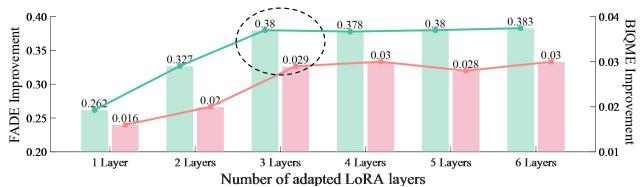

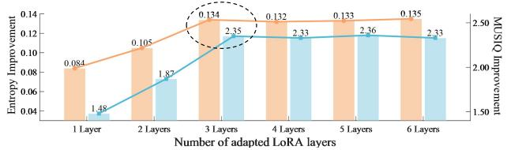  
Figure 13.Parameter analysis.The black dashed circle indicates the optimal selection.

## 6.3. Influence of Layer Number

The quantity of adapter layers is a critical factor of a model's adaptation capability for the target domain and its parameter efficiency. To explore this impact, we assessed the comprehensive performance of BiLaLoRA under different LoRA layer activation states. As shown in Fig.13, model performance improves steadily as the number of adaptation layers increases,with performance peaking at three layers.However,beyond this point, the performance improvement curve flattens, demonstrating clear diminishing marginal returns. These results indicate that additional adapter layers not only fail to deliver significant performance improvements but also lead to parameter redundancy and unnecessary computational overhead.

## 7. Concluding Remarks

BiLaLoRA automatically pinpoints and optimizes the performance bottleneck layers,significantly improving crossdomain performance with minimal parameter overhead. Leveraging the inherent plug-and-play nature of LoRA, Bi-LaLoRA provides a highly flexible and effective domain adaptation solution for real image dehazing.

Our future work will explore the application of Bi-LaLoRA to other low-level vision tasks in diverse realworld scenarios. Additionally, we plan to investigate more refined semantic guidance mechanisms and cross-domain adaptation techniques to address restoration challenges under severe degradation conditions.

## Acknowledgments

This research was supported by the foundations of Guangdong Basic and Applied Basic Research Foundation (No.2024A1515011563)， Natural Science Foundation of Hangzhou (No.2025SZRJJ1901), National Natural Science Foundation of China (No. 62506060).

## References

[1] Codruta O.Ancuti, Cosmin Ancuti,Radu Timofte,and Christophe De Vleeschouwer. O-haze:A dehazing benchmark with real hazy and haze-free outdoor images.In 2018 IEEE/CVF Conference on Computer Vision and Pattern Recognition Workshops,pages 867-8678,2018.6

[2] Codruta O Ancuti, Cosmin Ancuti,Mateu Sbert,and Radu Timofte.Dense-haze: A benchmark for image dehazing with dense-haze and haze-free images.In 2019 IEEE International Conference on Image Processing,pages 1O14-1018. IEEE,2019.6

[3] Zeyuan Chen, Yangchao Wang, Yang Yang,and Dong Liu. Psd: Principled synthetic-to-real dehazing guided by physical priors.In Proceedings of the IEEE/CVF Conference on Computer Vision and Pattern Recognition, pages 7180- 7189,2021. 2, 6

[4] Zixuan Chen, Zewei He,Ziqian Lu, Xuecheng Sun,and Zhe-Ming Lu. Prompt-based test-time real image dehazing:a novel pipeline.In European Conference on Computer Vision, pages 432-449. Springer,2024.2

[5] Zixuan Chen, Zewei He,and Zhe-Ming Lu. Dea-net: Single image dehazing based on detail-enhanced convolution and content-guided attention.IEEE Transactions on Image Processing,33:1002-1015,2024. 3,6

[6] Lark Kwon Choi, Jaehee You,and Alan Conrad Bovik.Referenceless prediction of perceptual fog density and perceptual image defogging. IEEE Transactions on Image Processing,24(11):3888-3901,2015.6,7

[7] Yuning Cui,Wenqi Ren,Xiaochun Cao,and Alois Knoll. Revitalizing convolutional network for image restoration. IEEETransactions on Pattern Analysis and Machine Intelligence,46(12):9423-9438,2024. 5

[8] Hang Dong, Jinshan Pan,Lei Xiang, Zhe Hu, Xinyi Zhang, Fei Wang,and Ming-Hsuan Yang.Multi-scale boosted dehazing network with dense feature fusion. In Proceedings of the IEEE/CVF Conference on Computer Vision and Pattern Recognition, pages 2157-2167,2020. 4,6

[9] Chengyu Fang，Chunming He,Fengyang Xiao,Yulun Zhang,Longxiang Tang,Yuelin Zhang,Kai Li,and Xiu Li. Real-world image dehazing with coherence-based pseudo labeling and cooperative unfolding network． In Advances in Neural Information Processing Systems,pages 97859- 97883.Curran Associates,Inc.,2024.2

[10] Raanan Fattal． Dehazing using color-lines.ACM Transactions on Graphics,34(1):1-14,2014. 1,6

[11] Changfeng Feng，Zhenyuan Chen， Xiang Li, Chunping Wang, Jian Yang,Ming-Ming Cheng, Yimian Dai,and Qiang Fu.Hazydet: Open-source benchmark for drone-view ob-

ject detection with depth-cues in hazy scenes.arXiv preprint arXiv:2409.19833,2024. 6

[12] Yuxin Feng,Long Ma, Xiaozhe Meng,Fan Zhou, Risheng Liu,and Zhuo Su. Advancing real-world image dehazing: Perspective,modules,and training．IEEE Transactions on Pattern Analysis and Machine Intelligence,46(12):9303- 9320,2024.6

[13] Yuxin Feng,Zhuo Su,Long Ma, Xin Li, Risheng Liu,and Fan Zhou. Bridging the gap between haze scenarios:A unified image dehazing model.IEEE Transactions on Circuits and Systems for Video Technology，34(11):11070-11085, 2024.5

[14] Yuxin Feng,Jufeng Li, Tao Huang,Fangfang Wu,Yakun Ju,Chunxu Li,Weisheng Dong,and Alex C. Kot. Crossfrequency attention and color contrast constraint for remote sensing dehazing. IEEE Transactions on Image Processing, 34:8552-8567,2025. 1

[15] Yuxin Feng,Xin Li,Fuwei Zhang,Chengpei Xu, Zhenyu Wang,Tao Huang,and Weisheng Dong.Visible-infrared joint image deraining for harsh rain conditions with crossmodal semantic consistency.Pattern Recognition,177: 113301,2026. 1

[16] Jiayi Fu,Siyu Liu,Zikun Liu,Chun-Le Guo,Hyunhee Park,Ruiqi Wu, Guoqing Wang,and Chongyi Li.Iterative predictor-critic code decoding for real-world image dehazing.In Proceedings of the Computer Vision and Pattern Recognition Conference, pages 12700-12709,2025.2,6

[17] Ke Gu, Dacheng Tao,Jun-Fei Qiao,and Weisi Lin. Learning a no-reference quality assessment model of enhanced images with big data.IEEE Transactions on Neural Networks and Learning Systems,29(4):1301-1313,2017.7

[18] Chun-Le Guo,Qixin Yan, Saeed Anwar,Runmin Cong, Wenqi Ren,and Chongyi Li. Image dehazing transformer with transmission-aware 3d position embedding.In Proceedings of the IEEE/CVF Conference on Computer Vision and Pattern Recognition, pages 5812-5820,2022.5,6

[19]Kaiming He, Jian Sun,and Xiaoou Tang. Single image haze removal using dark channel prior.IEEE Transactions on Pattern Analysis and Machine Intelligence,33(12):2341-2353, 2010.1

[20] Edward JHu,Yelong Shen,Phillip Wallis,Zeyuan Allen-Zhu,Yuanzhi Li, Shean Wang,Lu Wang,et al. Lora: Lowrank adaptation of large language models.In International Conference on Learning Representations,2022.2

[21] Yakun Ju,Boxin Shi,Bihan Wen,Kin-Man Lam,Xudong Jiang,and Alex C.Kot. Revisiting one-stage deep uncalibrated photometric stereo via fourier embedding．IEEE Transactions on Patern Analysis and Machine Intelligence, 47(8):6185-6199,2025. 1

[22] Yakun Ju,Jun Xiao,Cong Zhang,Hao Xie,Anwei Luo, Huiyu Zhou, Junyu Dong,and Alex C Kot. Towards marine snow removal with fusing fourier information. Information Fusion,117:102810,2025.1

[23] Junjie Ke, Qifei Wang,Yilin Wang,Peyman Milanfar,and Feng Yang. Musiq:Multi-scale image quality transformer. In Proceedings of the IEEE/CVF International Conference on Computer Vision,pages 5148-5157,2021. 4,7

[24] Steven G.Krantz and Harold R.Parks. The Implicit Function Theorem:History, Theory,and Applications.Springer Scence & Business Media,2002.5

[25] Boyi Li, Wenqi Ren, Dengpan Fu, Dacheng Tao,Dan Feng, Wenjun Zeng,and Zhangyang Wang.Benchmarking singleimage dehazing and beyond. IEEE Transactions on Image Processing,28(1):492-505,2018. 1,4,5,6

[26] Hao Li,Xiang Chen,Jiangxin Dong,Jinhui Tang,and Jinshan Pan. Foundir:Unleashing million-scale training data to advance foundation models for image restoration. In Proceedings of the IEEE/CVF international conference on computer vision,pages 12626-12636,2025.6

[27] Zhexin Liang,Chongyi Li,Shangchen Zhou,Ruicheng Feng,and Chen Change Loy. Iterative prompt learning for unsupervised backlit image enhancement.In Proceedings ofthe IEEE/CVF International Conference on Computer Vision,pages 8094-8103,2023.3

[28] Risheng Liu,Long Ma, Xiaoming Yuan, Shangzhi Zeng,and Jin Zhang.Task-oriented convex bilevel optimization with latent feasibility. IEEE Transactions on Image Processing, 31:1190-1203,2022.5

[29] Ye Liu, Lei Zhu, Shunda Pei, Huazhu Fu, Jing Qin, Qing Zhang,Liang Wan,and Wei Feng. From synthetic to real: Image dehazing collaborating with unlabeled real data.In Proceedings of the 29th ACM International Conference on Multimedia, pages 50-58,2021. 1,5

[30] Long Ma,Yuxin Feng,Yan Zhang, Jinyuan Liu,Weimin Wang,Guang-Yong Chen,Chengpei Xu,and Zhuo Su. Coa: Towards real image dehazing via compression-andadaptation.InProceedingsof the ComputerVision and Pattern Recognition Conference,pages 11197-11206,2025.6

[31] Long Ma, Tengyu Ma, Chengpei Xu, Jinyuan Liu, Xin Fan, Zhongxuan Luo,and Risheng Liu. Learning with selfcalibrator for fast and robust low-light image enhancement. IEEETransactions on Pattern Analysis and Machine Intelligence,47(10):9095-9112,2025. 1

[32] Dongwon Park，Hayeon Kim，and Se Young Chun. Contribution-based low-rank adaptation with pre-training model for real image restoration. In European Conference on Computer Vision,pages 87-105.Springer,2024.3

[33] Vaishnav Potlapali,Syed Waqas Zamir, Salman H Khan, and Fahad Shahbaz Khan.Promptir: Prompting for all-inone image restoration. In Advances in Neural Information Processing Systems,pages 71275-71293,2023.6

[34] Alec Radford,Jong Wook Kim，Chris Hallacy，Aditya Ramesh,Gabriel Goh,Sandhini Agarwal,Girish Sastry, Amanda Askell, Pamela Mishkin,Jack Clark,et al. Learning transferable visual models from natural language supervision． In International Conference on Machine Learning, pages 8748-8763,2021.2

[35] Claude E Shannon.A mathematical theory of communication. The Bell System Technical Journal,27(3):379-423, 1948. 7

[36] Yuanjie Shao,Lerenhan Li, Wenqi Ren, Changxin Gao,and Nong Sang. Domain adaptation for image dehazing.In Proceedingsof the IEEE/CVF Conference on Computer Vision and Pattern Recognition, pages 2808-2817,2020.1,6

[37] Zhuo Su,Jufeng Li, Yan Zhang,Xin Li,Fuwei Zhang, Yuxin Feng,and Fan Zhou.Breaking the synthetic barrier: Towards stable and generalizable real-world image dehazing.In Proceedings of the 33rd ACM International Conference on Multimedia,pages 8901-8909,2025.2

[38] Lingchen Sun,Rongyuan Wu, Zhiyuan Ma, Shuaizheng Liu, Qiaosi Yi,and Lei Zhang.Pixel-level and semantic-level ad-justable super-resolution: A dual-lora approach. In Proceedings of the Computer Vision and Pattern Recognition Conference,pages 2333-2343,2025.3

[39]Fu-Jen Tsai,Yan-Tsung Peng,Yen-Yu Lin,and Chia-Wen Lin．Phatnet: A physics-guided haze transfer network for domain-adaptive real-world image dehazing. In Proceedings of the IEEE/CVF International Conference on Computer Vision,pages 5591-5600,2025.6

[40] Yongzhen Wang,Xuefeng Yan,Fu Lee Wang,Haoran Xie, Wenhan Yang, Xiao-Ping Zhang, Jing Qin,and Mingqiang Wei. Ucl-dehaze: Toward real-world image dehazing via unsupervised contrastive learning. IEEE Transactions on Image Processing,33:1361-1374,2024.2

[41] Rui-Qi Wu, Zheng-Peng Duan,Chun-Le Guo,Zhi Chai, and Chongyi Li. Ridcp: Revitalizing real image dehazing via high-quality codebook priors. In Proceedings of the IEEE/CVF Conference on Computer Vision and Pattern Recognition,pages 22282-22291,2023.2,5,6

[42] Yang Yang,Chaoyue Wang,Risheng Liu,Lin Zhang,Xiao-jie Guo,and Dacheng Tao. Self-augmented unpaired image dehazing via density and depth decomposition. In Proceedings of the IEEE/CVF Conference on Computer Vision and Pattern Recognition, pages 2037-2046,2022. 2,6

[43] Eduard Zamfir, Zongwei Wu,Nancy Mehta, Yuedong Tan, Danda Pani Paudel, Yulun Zhang,and Radu Timofte. Complexity experts are task-discriminative learners for any image restoration.In Proceedingsof the Computer Vision and Pattern Recognition Conference,pages 12753-12763,2025.6

[44] Jing Zhang,Yang Cao, Zheng-Jun Zha,and Dacheng Tao. Nighttime dehazing with a synthetic benchmark.In Proceedingsof the 28th ACM International Conference on Multimedia,pages 2355-2363,2020.2,6

[45] Dian Zheng,Xiaoming Wu, Shuzhou Yang, Jian Zhang, Jianfang Hu,and Weishi Zheng. Selective hourglass mapping for universal image restoration based on diffusion model．In Proceedings of the IEEE/CVF Conference on Computer Vision and Pattern Recognition,pages 25445- 25455,2024. 6

[46] Yu Zheng,Jiahui Zhan, Shengfeng He, Junyu Dong,and Yong Du. Curricular contrastive regularization for physicsaware single image dehazing.In Proceedings of the IEEE/CVF Conference on Computer Vision and Pattern Recognition,pages 5785-5794,2023.6

[47] Zihan Zhong,Zhiqiang Tang,Tong He,Haoyang Fang, and Chun Yuan. Convolution meets lora: Parameter efficient finetuning for segment anything model. In International Conference on Learning Representations, pages 26755-26779,2024. 3